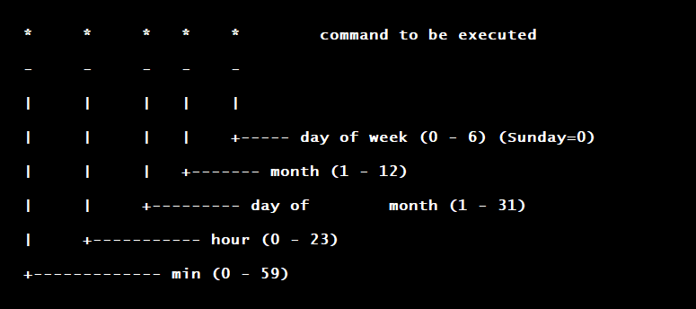

# crontab

## 基本命令

```sh
# list
crontab -l

# remove
crontab -r

# edit
crontab -e

# add
crontab <filename>
```

## 文件格式

使用的时候要注意用户，主目录和环境变量，实例：
```
SHELL=/bin/zsh
PATH=/sbin:/bin:/usr/sbin:/usr/bin:/usr/local/bin/
HOME=/home/fang

1 0 * * * /home/fang/healthy_everyday/auto_upload.py>>~/healthy_everyday.txt
55 22 * * * /home/fang/auto_renew_blog.sh>>~/build
```

```
* * * * * command to be executed
- - - - -
| | | | |+-------------- day of week (0 - 6) (sunday=0)
| | | |+-------------- month (1 - 12)
| | |+-------------- day of month (1 - 31)
| |+-------------- hout (0 - 23)
|+-------------- min (0 - 59)
```

### operators

> The asterisk (*) : This operator specifies all possible values for a field. For example, an asterisk in the hour time field would be equivalent to every hour or an asterisk in the month field would be equivalent to every month.

> The comma (,) : This operator specifies a list of values, for example: “1,5,10,15,20, 25”.

> The dash (-) : This operator specifies a range of values, for example: “5-15” days , which is equivalent to typing “5,6,7,8,9,….,13,14,15” using the comma operator.

> The separator (/) : This operator specifies a step value, for example: “0-23/” can be used in the hours field to specify command execution every other hour. Steps are also permitted after an asterisk, so if you want to say every two hours, just use */2.



## log

修改 `/etc/rsyslog.d/50-default.conf` 

对这一行解除注释

```
cron.*                          /var/log/cron.log
```

```sh
# 重启 rsyslog
sudo service rsyslog restart

# 查看 log
less /var/log/cron.log 
```

## 输出

默认情况下（没有重定向的情况），会把正确和错误信息都输出到 mail .

### 常用重定向

```sh
# 设置标准输出到 /dev/null（丢弃），异常输出绑定到正常输出。
# 注意理解，先后顺序调换意义不同。异常输出会保持默认，不会被重定向。
# 可以理解成 1 和 2 是虚值，不是实值，他代表信息种类，
# 但如果做为被重定向的对象是，指的是当前定向的设备。
# 正常情况 1 和 2 的定向设备都是 tty
# 所以如果先 2>&1 那命令会立即执行，把 2 的定向设备设置成 1 的设备（tty）。

/dev/null 2>&1
```