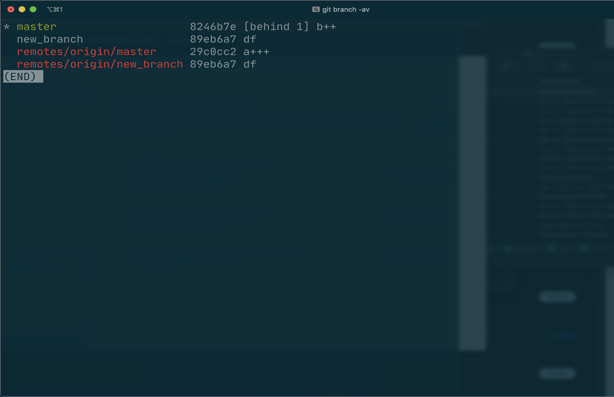
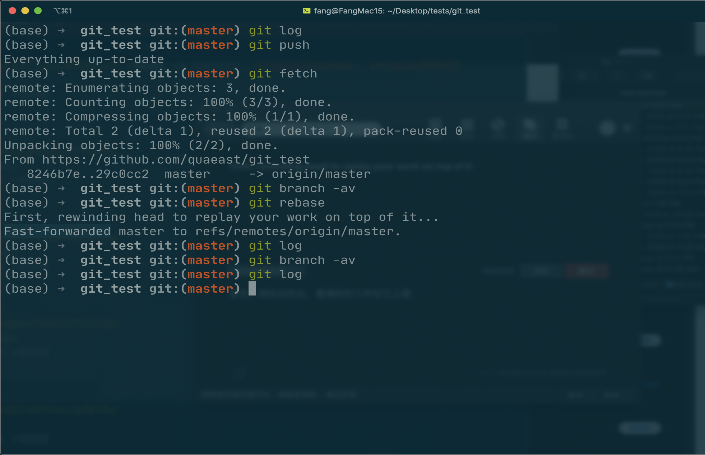
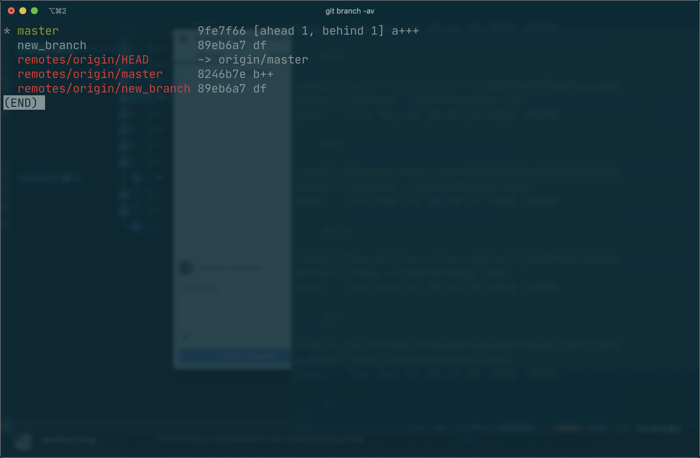
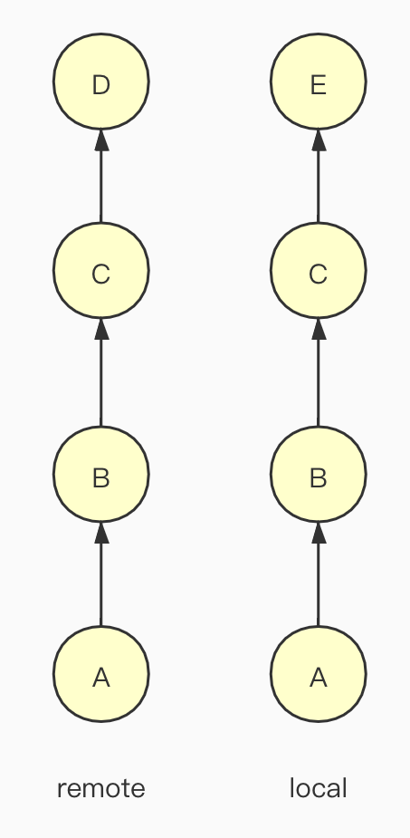
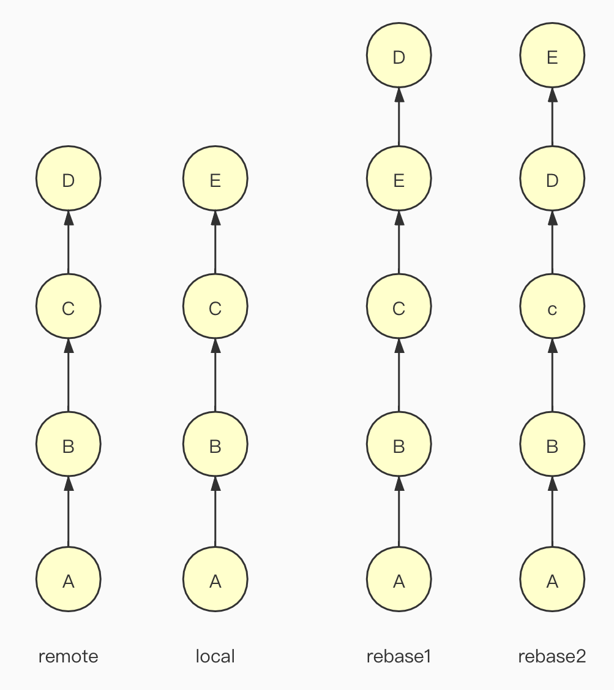
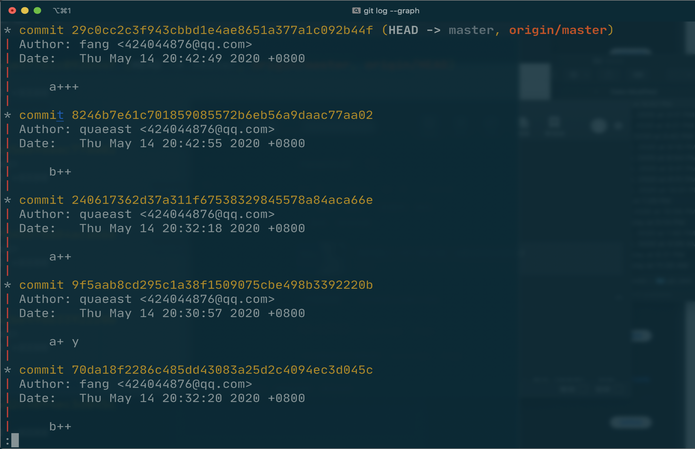
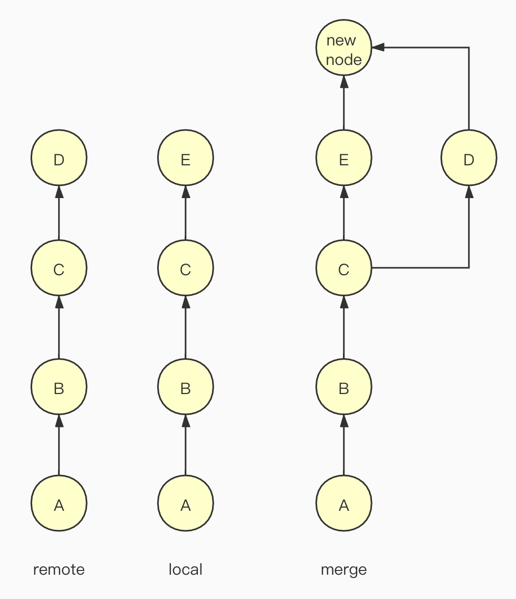
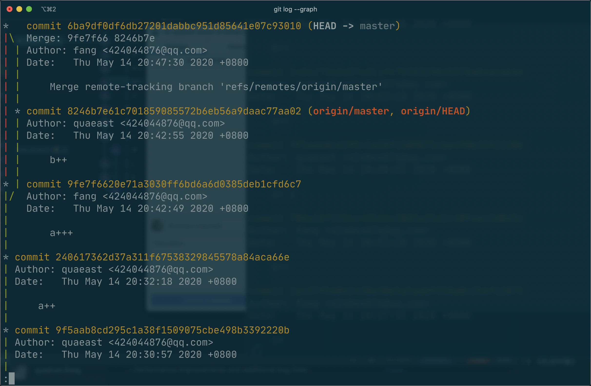

# git fetch 后 rebase 和 merge 区别

## 共同点

把 git fetch 之后 merge 和 rebase 的区别捋一捋。避免以后工作的时候成为一交代同事就害怕的恐怖程序员。如图1所示，如果本地分支仅仅是落后于远程分支，两种操作是没有任何区别的。他们之间唯一的差别就是图2那样，rebase之后会有一个faster-forward的提示，对于树的修改，没有任何差别。

## 差异

真正有区别的情况，是图3这种情况，即 fetch 回来之后发现既提前又落后。这如何理解呢？你落后的那个点是你的同事A提交到公共仓库的成果，公共仓库有这个点而你没有，所以你落后公共仓库一个点。提前的这一个点是你在本地进行的提交，本地仓库有而公共仓库没有，所以你提前了一个点。也就是像图4这样。前三个结点是一样的，从第四点开始有了歧义。

### rebase

而 rebase 得到的结果如图5和图6所示，按照提交的先后顺序，对着两个歧义的点进行整合，整体的树依然保持单条不分叉，非常的简洁。

至于排序，无论提交的先后顺序如何，自己的 local 的 ahead 结点都会被排在最上面（即rebase2的情况，而不是rebase1）。

First, rewinding head to replay your work on top of it...

这句话的意思就是调整头指针的位置，把你的工作放在了最上面。

### merge

而 merge 得到的结果如图7和图8所示，将树从没有歧义的第3点分叉，然后新建立一个节点，进行merge。

## 总结

这两种方式无所谓好坏，国内比较推崇的是前者，但是大多数傻瓜客户端默认的确是后者。所以在提交代码的时候一定要手动分成两步，先 fetch，再进一步操作。如果你碰到一个喜欢单线版本树的强迫症领导，却 merge 之后提交了，那公共仓库是不可以改的，这个仇 git 永远帮你记着，所以趁被开除之前赶快主动跳槽吧。