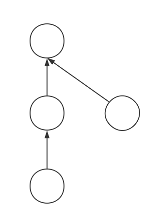
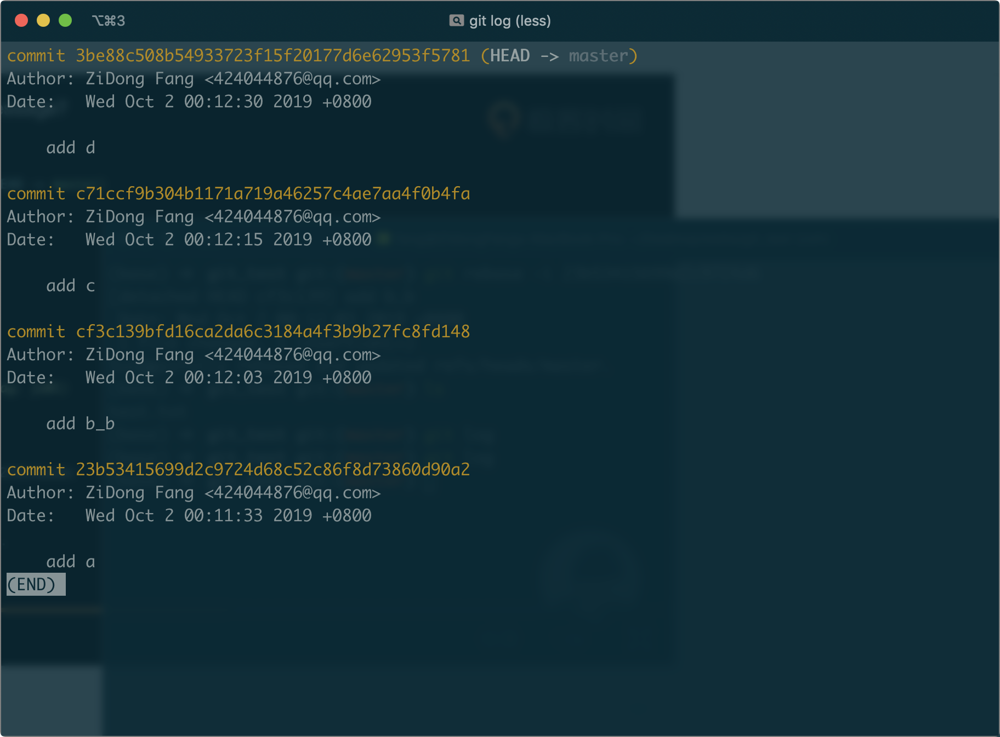
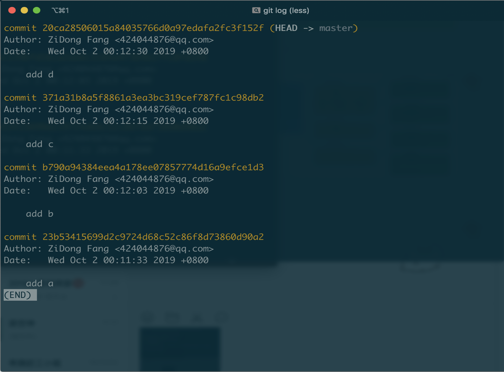
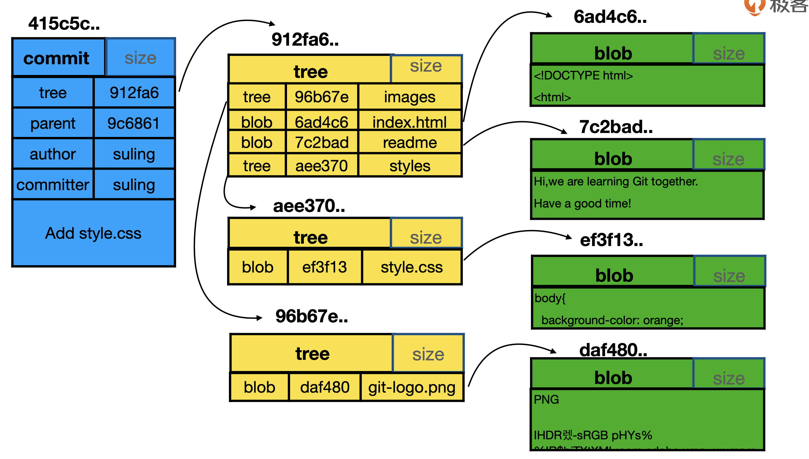

### [return](../README.md)

# git学习笔记

推荐使用[Gitkraken](https://www.gitkraken.com/)查看图形化 git 历史，更加直观。

## 初始化

```
git init				  # 文件夹内部
git init <dir>			# 文件夹外部，生成空项目
```

## config 配置

```
# 显示config
git config --local/--global/--system --list/-l

## 最小化配置，末尾不带字符串就是展示
git config --global user.name "name"
got config --global user.email "email"
```

## 个人工作

git 有三个工作区域，工作区，暂存区(stage)，历史区。


### 暂存区


#### git status

查看暂存区状态

```
git status
```

#### git add

向暂存区添加文件

```
git add -A	# 所有更改
git add -u	# 不更新新文件，只更新删除和修改
```

#### git rm

注意删除文件夹的时候要加参数 `-r`，如果工作区中文件已经被删除，那么删除 stage 中的文件就不需要加 `-f`。

```
# 从结果的角度考虑：就是不删除工作区的内容，让这个文件不出现在缓存区和和本次 commit 的历史区。
git rm --cache <filename>		
git rm -f <filename>			 # 删除全部 (stage 和工作区)
```

另一种删除全部的方法，即先删工作区再删 stage

```
rm <fileneme>
git rm <filename>
```


#### git mv

名命名文件，并直接将记录添加到暂存区

```
git mv <old filename> <new filename>
```

也可以

```
mv <old filename> <new filename>
git add -A
```

```
mv <old filename> <new filename>
git add <new filename>
git rm <olf filename>
```

### 历史区

#### git commit

```
# 提交
git commit -m "message"
git commit -am "message"	#跳过暂存区直接提交

# 修改(变更)最近提交信息
git commit --amend
```
#### git reset

```
git reset               # 默认模式为mixed，恢复点为HEAD指针
git reset <hush>		# 指定恢复点

# 恢复模式

--soft                  # 不更改工作区和暂存区
--mixed                 # 不更改工作区，但是清空暂存区（默认模式）
--hard                  # 更改工作区和，清空暂存区。（但是工作区新增的文件一般不会删除，但这个也不一定）
```

#### git log

```
git log --oneline       # 简洁显示
git log -n4             # 最近的四个
git log --all/-a        # 显示所有
git log --graph         # 图形显示
```

### git tag

```bash
# show
git tag
# add a tag
git tag -a tag-name -m "tag message"
# delete a tag
git tag -d tag-name

```


### 分支

#### git branch

```
# 显示分支
git branch -v		# verbose 长
git branch -a 	   # 包括远程

# 创建新分支，但是不切换
git branch <new branch_name>

# 删除分支
git branch -d <hush>	# merge 过的
git branch -D <hush>	# 没 merge 过的，强制删除
```

#### git checkout

```
# 切换分支
git checkout <branch_name>

# 创建新分支，并切换
git checkout -b <branch_name>

# 分离头指针
git checkout <commit_hush>

# 恢复某个文件和暂存区一样
git checkout -- <filename1> <filename2>
```

#### git merge

示意图



```
# merge 可以写一个分支，代表把这个分支和当前分支合并。也可以写两个，代表合并这两个分支
git merge <remote_name>/<branch_name>

git merge <branch A> <branch B>
```

#### git rebase

```
git rebase -i <hush>/--root
```

这里面的 `-i` 后面的 `<hush>` 是当前值的父亲。

#### git clone

```
# 注意地址是 .git 文件夹的地址
git clone <remote_address>
```

#### git remote

```
# 查看远程服务器
git remote -v

# 添加远程服务器
git remote add <address>

git remove <remote_name>

git rename <old> <new>
```

#### git fetch

```
git fetch <remote_name> <branch_name>...
```

#### git pull

```
git fetch <remote_name> <branch_name>...
```

#### git push

```
git fetch <remote_name> <branch_name>...
```

注意：push是remote报错，在远端设置：

```
git config receive.denyCurrentBranch ignore
```

## git rebase（变基）

### 变更历史提交信息

```
git rebase -i <father hush>
```







## git 高级：进入 .git

### 分离头指针（attached head）

~ 是指使用 checkout 将头指针指向 commit 而不是分支。这样头指针就不属于任何分支，但是正常 commit。如果有用可以后期把他附到分支上，如果没有用可以直接 checkout 到分支，将其丢弃。

其实分支的 hush 本身也是 commit，但是分支的头部 commit 能够代表分支。

```
# 分离头指针
git commit <commit_hush>

# 保留分支
git branch <new branch name> <commit_hush>
```

### 追踪文件

git object 有三类:

* commit
* tree
* blob



```
git cat-file -t <hush>		#查看文件类型
git cat-file -p <hush>		#查看文件内容
```
### .git/config

`remote`，`username` 等信息都存储在这个文件中，可以直接对这个文件更改。

### [return](../README.md)